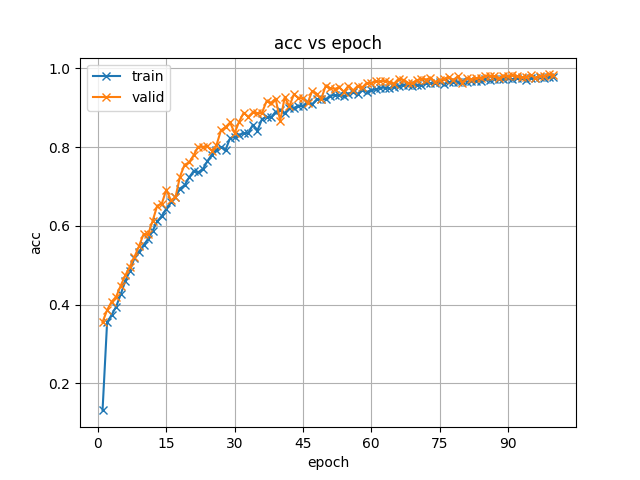
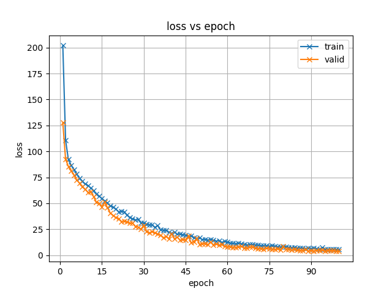
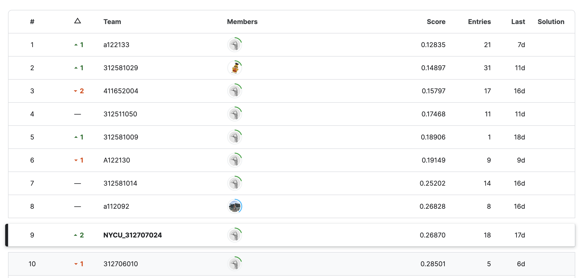

# taiwanese-speech-recognition-using-espnet-toolkit-NYCU312707024

本項目旨在使用三個不同的模型來實現台語語音識別任務，，包括ESPnet、S3PRL，以及OpenAI的Whisper模型。此項目的目的是提高語音識別的準確性和效率，並探索不同模型之間的組合和整合。

Kaggle連結：[NYCU-IAlS-DL2024-Taiwanese-ASR](https://www.kaggle.com/competitions/nycu-iass-dl2024-taiwanese-asr?rvi=1)

**Evaluation Metric : Word-Error Rate (WER)**
 WER= (D + S + I) / N × 100% （整個詞的字元都要正確，才算對）。
- N - total number of labels （總詞數）
- D - deletion errors （刪除錯誤）
- S - substitution errors （替換錯誤）
- I - Insertion errors （插入錯誤）

## Task #1: ESPnet Transformer & Task #2: Combine ESPnet with S3PRL

在Task中，本任務旨在使用ESPnet工具包中的Transformer模型進行台語語音識別。使用了ESPnet工具包中提供的數據集來訓練模型，並對模型進行了調參和優化。

### 環境設置

1. 創建Python虛擬環境：
   ```bash
   conda create -n espnet-env python=3.9.19
   conda activate espnet-env
   ```

2. 安裝requirements.txt中的庫：
   ```bash
   pip install -r espnet_requirements.txt
   ```

### 執行步驟
以下是對您提供的過程說明的重構，專注於說明流程而省略部分詳細的程式碼：

### 環境設置

[根據2022年在CMU舉行的教程](
   https://colab.research.google.com/github/espnet/notebook/blob/master/espnet2_recipe_tutorial_CMU_11751_18781_Fall2022.ipynb#scrollTo=S85-3X82kWbm
)，完成環境建構。

首先安裝必要的套件，包括`cmake`、`sox`、`libsndfile1-dev`、`ffmpeg`和`flac`。然後從GitHub克隆ESPnet，建立並啟動conda環境。

```bash
sudo apt-get install cmake sox libsndfile1-dev ffmpeg flac
git clone https://github.com/espnet/espnet
conda create --name espnet python=3.9.16
conda activate espnet
```

進入ESPnet工具目錄，設定anaconda環境，並編譯安裝ESPnet。

```bash
cd espnet/tools
./setup_anaconda.sh /path/to/conda espnet 3.9.16
make TH_VERSION=1.12.1 CUDA_VERSION=11.3 -j32
```

安裝完成後，繼續安裝需要的模組，例如`s3prl`。

### 創建新的自己的Recipe (my_taiwanese_espnet)

進入ESPnet的例子目錄（`egs2`），並設置新的語音識別任務（例如台灣話語音識別）的基本架構。

```bash
cd espnet/egs2
./TEMPLATE/asr1/setup.sh ./my_taiwanese_espnet/asr1
```

### 數據前處理

創建新的資料集目錄，將Kaggle數據集轉移到該目錄下。設定數據集的絕對路徑於`db.sh`。

```bash
mkdir -p espnet/egs2/my_taiwanese_espnet/asr1/downloads
# 設定數據路徑
echo "TAIWANESE=/espnet/egs2/my_taiwanese_espnet/asr1/downloads" >> espnet/egs2/my_taiwanese_espnet/asr1/db.sh
```

### 設置數據準備腳本

創建`data.sh`腳本以自動處理數據，這包括從原始音頻和轉寫文本生成Kaldi兼容的格式。

這個腳本將調用`data_prep.py`來轉換數據成Kaldi格式，涵蓋訓練和測試集。

### 運行任務

在`egs2/taiwanese/asr1`目錄下，確保所有必要的文件都在位後，可以通過`run.sh`啟動訓練過程。

```bash
./run.sh
```

這個過程將使用配置文件中指定的設置來執行自動語音識別的訓練，並進行模型評估和測試。

### 實驗結果
#### Task #1: ESPnet Transformer

| Leaderboard  | Score     |
| ------------ | --------- |
| Public       | 0.77758   |
| Private      | 0.80828   |


#### Task #2: Combine ESPnet with S3PRL

| Leaderboard  | Score     |
| ------------ | --------- |
| Public       | 0.75485   |
| Private      | 0.73774   |





## Task #3: OpenAI Whisper Finetuning

本任務旨在使用OpenAI的Whisper模型進行微調，以提高語音識別的準確性和效率。因為espnet的whisper感覺不太好用，這邊**使用了Hugging Face的transformers庫**來實現Whisper模型的微調。本次使用的模型為openai/whisper-small，主要參考了[Taiwanese-Whisper](https://github.com/ga642381/Taiwanese-Whisper)的實現去進行微調。

### 環境設置

1. 創建Python虛擬環境：
   ```bash
   conda create -n whisper-env python=3.10.13
   conda activate whisper-env
   ```

2. 安裝requirements.txt中的庫：
   ```bash
   pip install -r whisper_requirements.txt
   ```

### Data Pre-processing
請將kaggle資料集解壓縮並整理到到data目錄下（可自行從train切割出validation集）：
```
|-- data
    |-- train
      |-- sound
      |-- text.csv
      |-- text-toneless.csv
   |-- val
      |-- sound
      |-- text.csv
      |-- text-toneless.csv
    |-- test
      |-- sound
```
* sound中包含所有音訊檔案（.wav）
* text.csv中包含音訊檔案的轉錄文本
* text-toneless.csv中包含音訊檔案的轉錄文本（不含音調）。
  
此Repository僅提供簡易的資料集用作測試，如需完整資料集請至kaggle下載。

### Data Augmentation (Add Noise)
並在data中執行以下指令，以添加噪聲：
```
python data_aug.py --input tiny_train/sound --output tiny_train/noisy_sound 
python data_aug.py --input tiny_val/sound --output tiny_val/noisy_sound
```
或執行以下指令，以添加噪聲：
```bash
bash data_aug.sh
```

data_aug.py會將tiny_train/sound中的音訊檔案加入噪聲，並將產生的音訊檔案存放在tiny_train/noisy_sound中。
使用者也可將產生出來的sound-noise資料夾中的音訊檔案加入訓練資料集中，以增加模型的Robustness。

### Data Pre-processing

```bash
bash prepare_TAT.sh
```
或者執行以下指令：
```bash
python prepare_TAT.py --TAT_root ../data/train --output_root processed_data --toneless --noisy
```
prepare_TAT.py會將data/train中的音訊檔案轉成csv檔案，並將音訊檔案的路徑、音訊檔案的轉錄文本存放在processed_data中。使用者可以選擇是否加入音調（--toneless）以及是否加入噪聲（--noisy）(需要noisy_sound資料夾)。

### Training
```bash
python train.py
```
請修改train.py中的參數以符合自己的需求。
目前train.py中的參數如下：
```python
# TRAIN
input_arg["custom_set_train"] = "./processed_data/big_train.csv"  # 將資料集的.csv放在processed_data資料夾下
input_arg["custom_set_test"] = "./processed_data/val-toneless-noisy.csv"  # 將資料集的.csv放在processed_data資料夾下
input_arg["tokenize_config"] = "openai/whisper-small" # huggingface上面的openai/whisper-small
input_arg["model_config"] = "openai/whisper-small" #huggingface上面的openai/whisper-small
input_arg["output_dir"] = "tiny_noisy_result/" #要輸出的資料夾
input_arg["group_by_length"] = True
input_arg["num_proc"] = 1 # Modify in my server, Only 1 GPU
input_arg["language"] = "zh" # 使用繁體中文
input_arg["only_eval"] = False #是否只進行評估 => 用於inference   
```
### Inference
```bash
python train.py
```
但需要修改train.py中的參數以符合Inference的需求。
目前train.py中的參數如下：
```python
# INFERENCE
    input_arg["custom_set_train"] = "./processed_data/test.csv" # 將資料集的.csv放在processed_data資料夾下
    input_arg["custom_set_test"] = "./processed_data/test.csv"  # 將資料集的.csv放在processed_data資料夾下
    input_arg["tokenize_config"] = "openai/whisper-tiny"
    input_arg["model_config"] = "samll_noisy_result/checkpoint-22295" # 訓練好的模型
    input_arg["output_dir"] = "tiny_noisy_result_test/"
    input_arg["group_by_length"] = True
    input_arg["num_proc"] = 1 # Modify in my server, Only 1 GPU
    input_arg["language"] = "zh"
    input_arg["only_eval"] = True #是否只進行評估 => 用於inference
```
### Parse Result
將Inference的結果轉換成Kaggle上的格式：
```bash
python inference.py
```

### 實驗結果
| Leaderboard  | Score     |
| ------------ | --------- |
| Public       | 0.29022   |
| Private      | 0.26870   |


微調後的Whisper模型在台語語音識別任務中取得了不錯的效果，並在Kaggle上取得了0.29022的分數。通過對模型的進一步優化和調參，相信可以進一步提高模型的性能和準確性。

## 總結心得

本次專案是在NYCU-IAlS-DL2024競賽中使用ESPnet、S3PRL和OpenAI的Whisper模型進行台語語音識別的研究。這些模型分別在不同的任務中展示了其能力，並通過深入的配置和調整，我們成功地提高了語音識別的準確性和效率。

在ESPnet Transformer的任務中，我們採用了CMU教程提供的環境設置步驟和數據預處理方法。通過這些方法，我們得以精確地調整模型參數，並在公開榜上獲得0.77758的分數，私有榜上獲得0.80828的分數。

結合ESPnet與S3PRL的任務進一步展示了不同模型結合的潛力。這一階段，我們在公開榜上獲得0.75485的成績，而在私有榜上進一步提升到0.73774。這證明了技術融合的有效性，也為未來的實驗提供了新的方向。

最後，我們採用了Hugging Face的transformers庫來微調OpenAI的Whisper模型。這一步不僅加深了我們對於模型調整的理解，還顯著提高了模型的性能，最終結果表明，**whisper模型**在這個任務下的表現最為優秀，在**public leaderboard上取得了0.29022**的分數，**private leaderboard上取得了0.26870**的分數，最終在**leaderboard上排名第九**。這一成果不僅展示了Whisper模型在台語語音識別領域的強大適用性，也凸顯了數據前處理和增強的重要性。



透過本次作業，我深刻體會到了現代語音處理技術的強大與多樣性。ESPnet提供了一個高度靈活且功能豐富的平台，使得語音識別任務的設置和執行變得更加便捷。結合S3PRL的自監督學習方法進一步增強了模型對於不同語音條件的適應能力。此外，OpenAI的Whisper模型通過微調在多語言環境下取得了顯著的提升，為語音識別技術的發展帶來了新的可能性。這次的專案實驗讓我對語音識別技術有了更深入的了解。通過使用不同的模型和方法，我們成功提升了模型的表現。從ESPnet的基礎設置到Whisper模型的微調，每一步都充滿挑戰，也都是學習的機會。這次的經驗對未來無論是學術還是實務應用都有很大的幫助。
